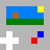

# LuaG Console
LuaG is a virtual console that runs lua games.

# C port
This project is a C port with improvements to the <!-- REMEMBER TO CHANGE THE LINK -->[Java version](https://github.com/Vulcalien/LuaG-Console).\
Cartridges made for the Java version of LuaG Console are supposed to work in the C port without any changes.

# Built With
- [SDL 2](https://www.libsdl.org/): window, video, audio, input...
- [lua 5.4](https://www.lua.org/): the core library that makes the games run
- [libarchive](https://www.libarchive.org/): handles the LuaG cartridges extraction and creation

## Windows specific libraries
- [dlfcn-win32](https://github.com/dlfcn-win32/dlfcn-win32): implements the dlfcn functions (POSIX) needed to load LuaG Libraries.

# License
This project is released under the GPL 3+. See [COPYING](COPYING).\
Any work that uses it must therefore be released under a [GPL-Compatible license](https://www.gnu.org/licenses/license-list.html.en).
